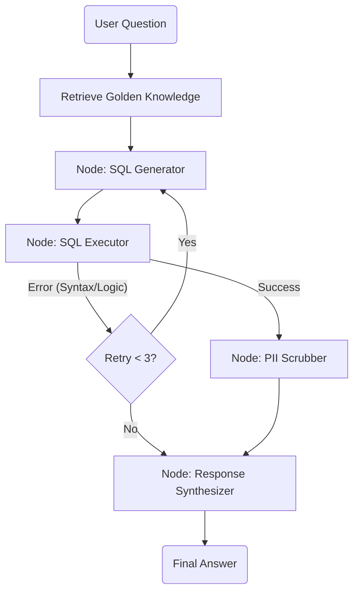
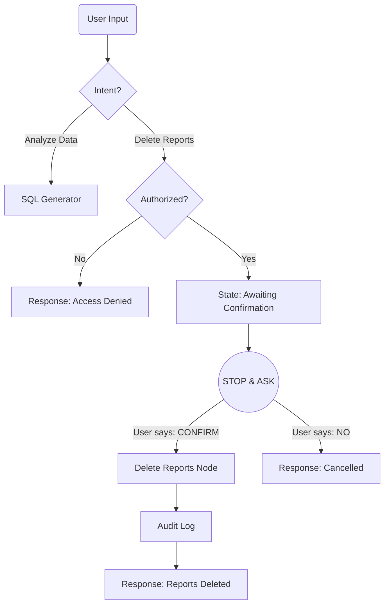
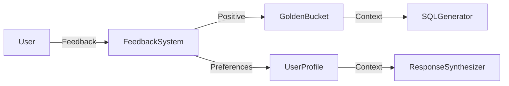

# Retail Data Analysis Chat Assistant

A resilient, safe, and intelligent data agent built with **LangGraph** and **Google Gemini**.

## Assessment requirements checklist 

| Requirement | Implementation Details | Status |

| **1. Hybrid Intelligence** | **RAG Pipeline**: `GoldenKnowledgeBase` retrieves similar SQL examples (using FAISS) to guide Gemini. Verified via "Tracer Bullet" test. | ✅ Implemented |
| **2. Safety & PII Masking** | **PII Scrubber Node**: Vectorized Pandas logic redacts Email, Phone, Name, and Address from results *before* synthesis. | ✅ Implemented |
| **3. Oversight (Destructive Ops)** | **Design Only**: HITL architecture with `interrupt_before` and `Intent Router` described in "High-Stakes Oversight Design". | Designed |
| **4. Continuous Improvement** | **Design Only**: "Auto-Correct Loop" (System) and User Profile Store (User) described in "Continuous Improvement Design". | Designed |
| **5. Resilience** | **Self-Correction Loop**: `should_retry` edge catches SQL errors and feeds them back to the LLM for correction (max 3 retries). | ✅ Implemented |
| **6. Quality Assurance** | **Golden Set Runner**: implemented with the mock FAISS store. "Tracer Bullet" confirms RAG usage. | ✅ Implemented |
| **7. Logging** | **Contextual Logs**: System logs SQL generation, RAG hits, and Execution results using python native logging. Design proposed for a **LangSmith** integration. | ✅ Implemented |
| **8. Agility (Persona)** | **Config File**: `config/persona.yaml` controls agent tone. Hot-reloadable via Docker Volumes (Dev) or ConfigMaps (Prod). | ✅ Implemented |

---

## Architecture

The system follows a cyclic graph architecture designed for resilience and safety.



### Component Breakdown
1.  **Hybrid Intelligence (RAG)**: Before generating SQL, the agent searches a "Golden Knowledge" vector store (FAISS) for similar past queries and their validated SQL. This grounds the LLM, reducing hallucinations.
2.  **SQL Generator (Gemini)**: converting natural language to BigQuery SQL, utilizing the retrieved context.
3.  **SQL Executor**: Runs the query against `bigquery-public-data`. If it fails, it returns the error to the Generator for self-correction.
4.  **PII Scrubber**: A safety layer that scans results for regex patterns (Emails) and heuristics (Names) to redact sensitive data *before* it reaches the context window for synthesis. The list of PII data derived from the tables' schemas. *Design note* : in prod environment I would use Microsoft Presidio - since it is the industry standard library. It uses NLP (Named Entity Recognition) to detect PII even in messy text, not just by column name.
5.  **Response Synthesizer**: Converts raw data into a persona-driven natural language response (e.g., "Professional Analyst"). The persona is configurable via the `config/persona.yaml` file.

---

## Technical Design & Decisions

### 1. Framework: LangGraph
I chose **LangGraph** over a linear chain because of the **Resilience** requirement. The "Self-Correction Loop" (detecting SQL errors and sending them back to the LLM) requires a cyclic state machine, which LangGraph handles natively.

### 2. Data Flow
1.  **Input**: User asks "Top 5 customers by spend".
2.  **Retrieval**: System finds a similar validated query: `SELECT * FROM users ORDER BY spend...`.
3.  **Generation**: Gemini 2.5 uses the schema + similar example to write the SQL.
4.  **Execution**: The SQL runs on BigQuery.
    *   *Fallback*: If the query fails (e.g., "Column not found"), the error is fed back to Gemini: *"The previous query failed with X. Fix it."*
5.  **Safety**: The result set `[{name: "John Doe", spend: 500}]` is scrubbed to `[{name: "[REDACTED]", spend: 500}]`.
6.  **Synthesis**: The LLM reads the scrubbed data and answers: "The top customer spent $500."

### 3. Error Handling
*   **SQL Errors**: Handled by the retry loop (max 3 attempts).
*   **Empty Results**: Handled by the Synthesizer ("No data found" as default fallback message.).
*   **API Failures**: Caught in individual nodes; the graph continues to a graceful error message rather than crashing the app.


---

## Setup Instructions

### Prerequisites
- Docker & Docker Compose
- Google Gemini API Key

### 1. Configuration
**NOTE** : I will leave my google project API key in place in the actual .env file - feel free just to add your Gemini API key. The gcp-key.json stays as well since it is just a dummy project. 

Copy the template and add your API Key:
```bash
cp .env.template .env
# Edit .env and set GOOGLE_API_KEY
```


### 2. Run with Docker
```bash
docker-compose up --build
docker-compose run --rm agent
```

### 3. Usage
Once running, the CLI will ask for your input.
Try asking:
- "What are the top 5 users by spend?"
- "Show me revenue for the last year."
- "Calculate total sales by product category."

### Project Structure
```
src/
├── nodes/                        # LangGraph Nodes
│   ├── sql_generator.py
│   ├── sql_executor.py
│   ├── pii_scrubber.py
│   └── response_synthesizer.py
├── utils/
│   └── golden_knowledge.py       # Mock Vector Store
├── graph.py                      # Workflow Definition
├── state.py                      # State Schema
└── main.py                       # Entry Point
```


### **REQUIREMENTS WALKTHROUGH**

### Verification of Hybrid Intelligence (Tracer Bullet)
To verify that the system is using the "Golden Knowledge" retrieval effectively, I injected a "Tracer Bullet" into the `golden_trios.yaml` dataset:
```yaml
- question: "Calculate total sales by product category."
  sql: |
    SELECT 
        "golden_bucket_hit" as golden_bucket_used,
        ...
```
When asking a similar question (e.g., "How much revenue did each category generate?"), the system retrieves this example and the LLM copies the tracer column `"golden_bucket_hit"` into the generated SQL. This provides definitive proof that the RAG pipeline is influencing generation.

---
### Safety & PII Masking
*Implementation of strict data protection.*

The system proactively prevents data leaks using a dedicated **PII Scrubber Node**.
*   **Mechanism**: A deterministic Python/Pandas layer that runs *after* SQL execution but *before* the LLM sees the data.
*   **Coverage**:
    *   **Regex**: Patterns for Email and Phone numbers.
    *   **Column Heuristics**: Redacts entire columns containing "name", "address", "ssn", "credit_card", "ip_address", etc.
*   **Vectorized Speed**: Uses Pandas `apply` and compiled regex for high-performance scrubbing on large result sets.
*   **Fail-Safe**: If a user asks "Show me all emails", the SQL executes, but the Scrubber replaces the content with `[REDACTED_EMAIL]` before the Chat Agent can read it.

> **Design Note**: In a production environment, I would use **Microsoft Presidio** as it is the industry standard for NLP-based PII detection (Named Entity Recognition), capable of handling unstructured text better than heuristics.
---

### High-Stakes Oversight (Destructive Ops) Design
*Proposed Architecture for handling sensitive commands (e.g., "Delete Reports").*

To satisfy the requirement for strict oversight on destructive actions, I would design a **Human-in-the-Loop (HITL)** flow:



**Implementation Strategy:**
1.  **Intent Router**: A lightweight classification node (LLM or Keyword) determines if the user wants to `QUERY` or `MODIFY`.
2.  **State Management**: The graph state tracks `pending_action` (e.g., `{"action": "delete", "target": "Client X"}`).
3.  **LangGraph Interrupt**: I use `workflow.compile(interrupt_before=["execute_delete"])`. This pauses the graph execution right before the destructive node.
4.  **Confirmation Loop**: The user must provide a specific confirmation token (e.g., "CONFIRM"). The graph resumes only if this token is present; otherwise, it cancels the operation.

---

### Continuous Improvement (Learning Loop) Design
*Proposed Architecture for adapting to user preferences and system learning.*



**1. User-Level Learning (Personalization)**
*   **Mechanism**: A persistent User Profile store (Postgres/Redis/DynamoDB?).
*   **Data**: Stores formatting preferences (e.g., `Manager_A: {format: "table", tone: "concise"}`).
*   **Flow**:
    1.  At the start of a session, `UserProfileNode` loads preferences.
    2.  These are injected into the `ResponseSynthesizer` prompt: *"The user prefers tables. Format accordingly."*
    3.  If the user says "Stop using tables", an `UpdateProfile` background task updates the store.

**2. System-Level Learning (The "Auto-Correct Loop")**
*   **Concept**: Self-Supervised Learning from runtime errors.
*   **Mechanism**: If the agent makes a mistake (SQL Error) but successfully fixes it via the `Resilience Loop`, we treat this as a learning opportunity.
*   **Flow**:
    1.  Agent generates `SQL_v1` -> Fails (Syntax Error).
    2.  Agent self-corrects to `SQL_v2` -> Success.
    3.  **Action**: The system automatically captures `(User Question, SQL_v2)` and promotes it to the "Golden Knowledge" vector store.
    4.  **Result**: The next time a user asks a similar question, the agent retrieves the *correct* SQL immediately, bypassing the error loop. This effectively reduces latency and cost over time.

---

### Resilience & Graceful Error Handling
*Implementation of self-healing workflows.*

The system is designed to recover from failures without crashing or confusing the user.
*   **Self-Correction Loop**: When `SQL Executor` encounters a database error (e.g., "Column not found"), it doesn't give up. It passes the specific error message back to the `SQL Generator` node.
*   **Contextual Repair**: The LLM receives the error and its previous failed query, allowing it to "Fix the SQL" (e.g., correcting a table name or syntax).
*   **Retry Budget**: The graph allows up to **3 retry attempts** to prevent infinite loops and cost overruns.
*   **Graceful Failure**: If the agent cannot fix the query after 3 tries, it degrades gracefully, routing to the `Response Synthesizer` to explain the difficulty to the user instead of throwing a stack trace.

---

### Quality Assurance - Logging - Tracing & Observability
To support "Deep Dive" analysis, the system can be integrate with **LangSmith**.
*   **Metrics**: Error Rate (SQL failures), PII Trigger Frequency, and Latency.
*   **Tracing**: By setting `LANGCHAIN_TRACING_V2=true`, every step of the graph (Retrieval -> Generation -> Execution) is recorded, allowing developers to inspect exactly where the logic failed (e.g., "Did the Golden Bucket return bad examples?").

---

### Agility (Persona Management)
The agent's "Personality" is decoupled from code.
*   **Configuration**: `config/persona.yaml`.
*   **Update Process**: Non-developers can edit the YAML file (e.g., change `tone: "casual"` to `tone: "executive_summary"`).
*   **Deployment**: In this Docker setup (Development Mode), the file is volume-mounted, so changes apply immediately without a rebuild. In production, this would be a ConfigMap update.

---


