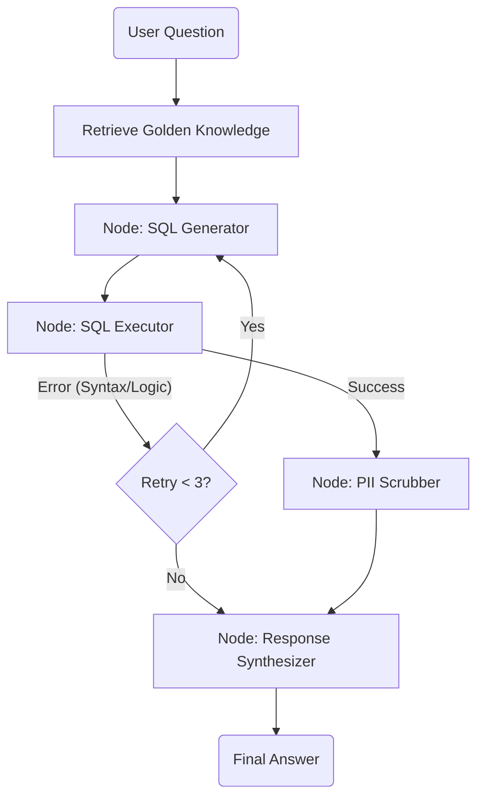
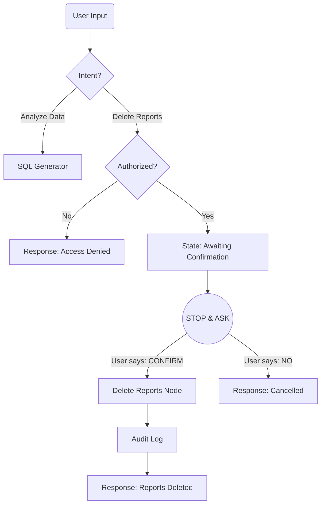

# System Architecture

## High Level Design (HLD)

The system is built using **LangGraph** to orchestrate a cyclic workflow that ensures resilience, safety, and continuous improvement.

### Architecture Diagram

### Component Breakdown

1.  **Hybrid Intelligence (RAG)**: 
    - Before generating SQL, the agent searches a **"Golden Knowledge"** vector store (FAISS) for similar past queries and their validated SQL. 
    - This grounds the LLM (Gemini 2.5 Flash), reducing hallucinations.

2.  **SQL Generator**: 
    - Converts natural language to BigQuery SQL, utilizing the retrieved context.
    - Receives feedback from the Executor if the previous query failed.

3.  **SQL Executor**:
    - Runs the query against `bigquery-public-data`.
    - **Self-Correction**: If the query fails, it returns the error to the Generator.

4.  **PII Scrubber (Safety Layer)**:
    - Scans result DataFrames for sensitive columns (Email, Name, Address).
    - Uses regex and column-name heuristics to redact data *before* it reaches the synthesis step.

5.  **Response Synthesizer**:
    - Converts raw data into a persona-driven natural language response.
    - Persona is configurable via `config/persona.yaml`.

---

## 🛡️ Advanced Design Features

### High-Stakes Oversight (Destructive Ops)
*Proposed Architecture for handling sensitive commands (e.g., "Delete Reports").*

### Continuous Improvement (Learning Loop)

**1. User-Level Learning (Personalization)**
*   **Mechanism**: A persistent User Profile store.
*   **Flow**: Inject user preferences (e.g., "concise tone") into the `ResponseSynthesizer` prompt.

**2. System-Level Learning (The "Auto-Correct Loop")**
*   **Concept**: Self-Supervised Learning from runtime errors.
*   **Mechanism**: If the agent makes a mistake (SQL Error) but successfully fixes it via the `Resilience Loop`:
    1.  Agent generates `SQL_v1` -> Fails.
    2.  Agent self-corrects to `SQL_v2` -> Success.
    3.  **Action**: The system automatically captures `(User Question, SQL_v2)` and promotes it to the "Golden Knowledge" vector store.
